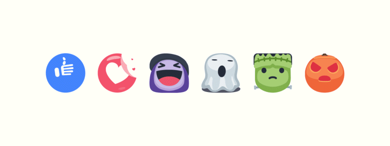

# Projeto README (Vandeberg)

Projeto com intuito para o Readme

[]

## Tecnologias Utilizadas

- HMTL
- CSS
- JavaScript

## Como Utilizar o Projeto

1 - Clone o Projeto do GitHub

```
git clone <url>
```

2 - Acesse a pasta do Projeto 

```
cd nome da pasta do projeto
```